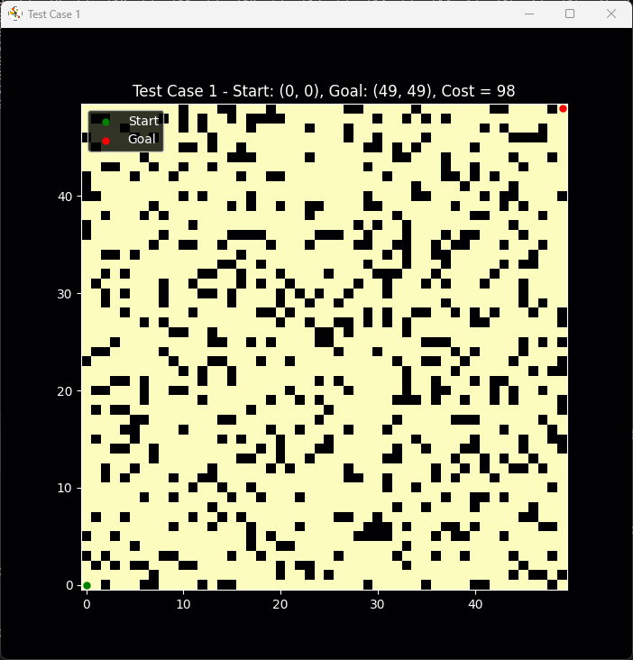

# A* Search Algorithm with Maze Visualization

## 🚀 Overview

This project implements the **A\*** (A-Star) algorithm to find the shortest path in a grid-based maze with random obstacles and weighted paths. It includes visualization using **Matplotlib** to display the maze, the computed path, and the animation of the pathfinding process.

## Showcase


## 📊 Features

- **A\*** Algorithm for efficient pathfinding
- Random maze generation with:
  - Obstacles.
  - Weighted paths (cost values 2-5).
- Dynamic path visualization with animation.
- Customizable maze size, obstacle density, and weighted paths percentage.

## 🧩 Algorithms Used

- **Heuristic:** Euclidean Distance or Manhattan distance.
- **Pathfinding:** A\* (A-Star) Algorithm.
- **Graph Representation:** Grid-based with weighted edges using `matplotlib` and also within the console using `#` for obstacles and numbers 2-5 for path costs.

---

## 🗺️ How It Works

1. **Maze Generation:**
   - `create_maze`: The maze is generated with random obstacles and weighted paths using the specified parameters for maze `width`, `height`, `obstacle_percentage`, `weighted_percentage`, `seed`.
   - Obstacles block movement, while weighted paths increase traversal cost.

2. **Pathfinding:**
   - The A* algorithm searches for the shortest path from the start to the goal using the heuristic function.

3. **Visualization:**
   - The maze and the found path are visualized with `matplotlib`.
   - Animated path tracing highlights the algorithm's process.

---

## 📝 Usage

Run the script to execute predefined test cases:

```bash
python a_star_pathfinding.py
```

Or customize your own test cases:

```python
test_cases = [
    {"size": (50, 50), "start": (0, 0), "goal": (49, 49), "obstacle_percentage": 0.2, "weighted_percentage": 0.1},
    {"size": (75, 75), "start": (0, 0), "goal": (74, 74), "obstacle_percentage": 0.3, "weighted_percentage": 0.5},
]
```

### Parameters:

- `size`: Tuple defining maze dimensions (width, height).
- `start`, `goal`: Coordinates for the start and goal positions.
- `obstacle_percentage`: Percentage of obstacles in the maze.
- `weighted_percentage`: Percentage of weighted paths with cost `> 1`.

---

## 📊 Example

- **Start:** (0, 0)
- **Goal:** (49, 49)
- **Maze Size:** 50x50
- **Obstacle Density:** 20%
- **Weighted Paths:** 10%

The output includes:

- Console log of the path and its total cost.
- Visualized maze with animated path traversal using `matplotlib`.

---

### Key Functions:

- `a_star(graph, start, goal)`: Executes the A* algorithm.
- `create_maze()`: Generates the maze.
- `visualize_path()`: Animates the solution.
- `test_a_star()`: Runs test cases.

---

## 🛠️ Customization

- **Change Heuristic:**
  
  - Use Manhattan distance:
    
    ```python
    return abs(goal[0] - node[0]) + abs(goal[1] - node[1])
    ```
- **Adjust Visualization Speed:**
  
  - Modify `plt.pause(0.05)` to speed up/slow down animation
- **Toggle Dark Mode:**
  
  - `plt.style.use('dark_background')`
